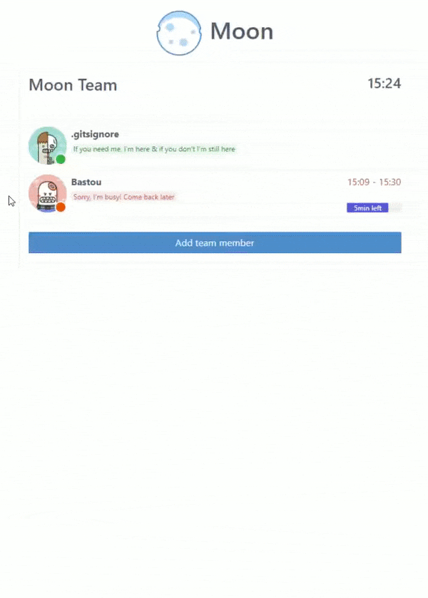

# Moon &middot; [](https://github.com/gitsignore/moon/blob/master/LICENSE) [](https://www.guardrails.io)

Moon is a beautiful web interface to define team statuses like online, busy, away or offline.Your team should be focus on their work only, let Moon manage your time availability.



In addition, you can set a focus time to keep your attention on specific tasks.

## Installation

To use `Moon` app you also need to install [moon-storage](https://github.com/gitsignore/moon-storage).

1. Docker installation

   - Install `Moon` by running:

   ```sh
   git clone https://github.com/gitsignore/moon && cd moon
   ```

   - Build `Moon`'s app:

   ```sh
   docker build -t moon .
   ```

   - Run `Moon`'s app:

   ```sh
   docker run -e PORT=3000 -e REACT_APP_API_URI=http://localhost -e REACT_APP_API_PORT=8080 -e REACT_APP_API_ENTRYPOINT=/teams -p 3000:3000 -p 35729:35729 -v $(pwd):/usr/src/app --name moon -d moon
   ```

   - Open your browser to <http://localhost:3000>

2. Local Node/npm installation

   - Install `Moon` by running:

   ```sh
   git clone https://github.com/gitsignore/moon && cd moon
   ```

   - Then install dependencies:

   ```sh
   npm install
   ```

   - Launch `Moon` app with:

   ```sh
   npm start
   ```

   - Open your browser to <http://localhost:3000>

## License

Moon is MIT licensed.
